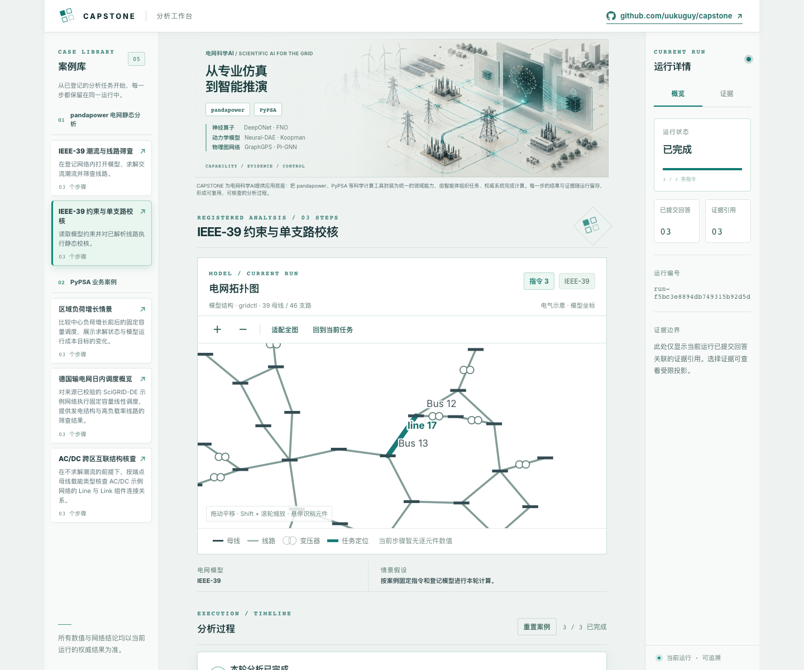
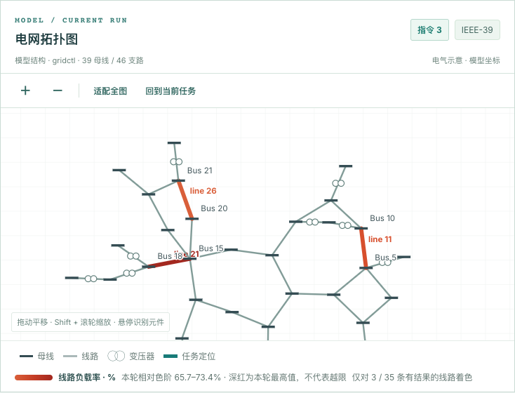

# Capstone Agent Framework

English | [简体中文](README.zh-CN.md)

Capstone lets an agent organize an analysis while established domain systems do the calculations. It keeps each step's results and evidence in the same run, so an application can show a conclusion, revisit the process, and trace it back to a model and calculation.

Power-grid analysis is the first group of applications in this repository. pandapower supplies static grid calculations; PyPSA supplies registered modeling, operations, and planning capabilities. The framework is not tied to power systems: a separate Domain Pack defines the capabilities and authority boundary for each new domain.



## Explore the workbench

The [operator App](packages/capstone-app/) includes five registered cases: two IEEE-39 static-analysis cases and three PyPSA cases covering regional demand, SciGRID-DE dispatch, and AC/DC interconnection. Opening a case shows its full model diagram. You can run its three instructions one at a time or complete them automatically.

The grid diagram focuses on relevant components as the run advances. You can select a completed step to revisit its view. Numeric coloring uses only results admitted for that run. When the run finishes, its report appears below the timeline; status and evidence are available in the right panel.



The public workbench runs registered scripted cases without calling a billed LLM provider. Natural-language tool orchestration has a separate CLI path and credential setup in the [runbook](docs/RUNBOOK.md).

## How Capstone works

```text
Application → Domain Pack → Kernel → registered Authority
```

| Part | Responsibility |
| --- | --- |
| Application | Select capabilities, provide an App or CLI, and present answers and reports |
| Domain Pack | Define domain tools, contracts, policy, guides, and result/evidence admission |
| Kernel | Manage runs, turns, bounded context, trajectories, artifacts, and replay |
| Authority | Access registered models, calculate or retrieve facts, and produce results and evidence |

The agent can call only published semantic tools. It has no direct access to pandapower objects, PyPSA internals, arbitrary commands, or files. Numerical and network claims come from the corresponding authority and return through explicit result and evidence references. The Kernel remains domain-neutral. An application can explicitly compose multiple Domain Packs while keeping domain state and credentials separate.

See the [framework architecture](docs/architecture/capstone-framework.md) for ownership and data flow, or the [Domain Pack onboarding guide](docs/guides/domain-pack-onboarding.md) to add a domain.

## Run the workbench locally

You need Docker Compose, Node.js 22.19+, and npm. Create a local environment file and replace its example secrets with local values:

```sh
cp deploy/local.env.example deploy/local.env
docker compose --env-file deploy/local.env config --quiet
docker compose --env-file deploy/local.env up --build -d
make setup-capstone-app
make capstone-app-dev
```

After source changes, use the repeatable local rebuild entrypoint so API and
worker cannot keep using an old image:

```sh
make capstone-local-rebuild
```

The rebuild validates the environment, rebuilds and replaces both backend
roles, waits for readiness, verifies that they use the same image digest, and
ensures the Vite App is reachable (starting it in the background when needed).
It verifies the local pinned PyPSA model library and stages it into the image
build, so local rebuilds do not download those model files again.
Set `CAPSTONE_START_APP=0` to skip App startup or `CAPSTONE_LOCAL_PULL=1` when
base images should also be refreshed.

Open `http://127.0.0.1:5173/` to enter the agent conversation workspace directly. Local Compose enables open Thread access; no login or browser token is needed. Use **New conversation** and **Conversation list** in the conversation area to create, switch, archive or restore Threads. New Threads receive a URL that can be refreshed without creating another Thread. Drafts stay in the browser session; temporary connection loss triggers automatic recovery. Older messages load in pages. The original registered-case workspace is at `/old`; its API-issued scoped credential needs no manual token. Cases still run through the real Provider/LLM path. The local App listens on the LAN by default, so a phone on the same network can open `http://<computer-lan-ip>:5173/`. Vite proxies browser requests to the loopback API; the API itself remains loopback-only. Set `CAPSTONE_APP_HOST=127.0.0.1` to restrict the App to the computer. Reports and evidence stay in private artifact storage, and the browser reads bounded content through the API. See the [runbook](docs/RUNBOOK.md#hosted-app-and-deployment) for access modes, ports, Provider configuration, and troubleshooting.

## Use the CLI

CLI development also needs Python 3.12+ and `uv`. Install dependencies and run a provider-free check:

```sh
make setup
make doctor
make run QUESTION="IEEE-39节点系统中线路11连接哪两个母线?"
```

The five catalog cases use the same real Provider/LLM path as the App:

```sh
make capstone-agent-pandapower-task
make capstone-agent-pandapower-test
make capstone-agent-pypsa-regional
make capstone-agent-pypsa-scigrid
make capstone-agent-pypsa-ac-dc
```

Configure a Provider credential before running these commands. The `*-scripted*`
and `*-demo` request files remain deterministic offline validation fixtures; they
are not the LLM execution path.

`grid-agent` is the pandapower application's compatibility CLI. Its `run`, `analysis`, and `report` commands write one JSON object with `question_id` and `answer_output` to stdout; progress and diagnostics go to stderr. For natural-language analysis with an LLM, use `make run-llm` after configuring the provider and Pi as described in the [runbook](docs/RUNBOOK.md). Never put credentials in command arguments or committed files.

## Deploy

The App can be hosted on Railway or Vercel and connects to the Capstone API
through `VITE_API_ORIGIN`.

- [Railway deployment](deploy/railway/README.md)
- [Cloud Run + Vercel deployment](deploy/cloud-run/README.md)
- [Full runbook](docs/RUNBOOK.md)

For focused frontend checks, run `make test-capstone-app` and `make build-capstone-app`. The full offline gates are `make test`, `make test-e2e`, and `make validate`. Provider validation requires separate authorization and may be billed.

## Read more

- [Capstone architecture](docs/architecture/capstone-framework.md): layer ownership, composite output, and current-run evidence
- [pandapower capability architecture](docs/architecture/pandapower-capability-composition.md) and [executable capability matrix](configs/capabilities/pandapower-3.4.0-static-analysis.json)
- [Pandapower application guide](docs/PANDAPOWER-APPLICATION.md): compatibility CLI, reports, and evidence contracts
- [Current project state](docs/status/CURRENT-STATE.md): implementation status and known limits
