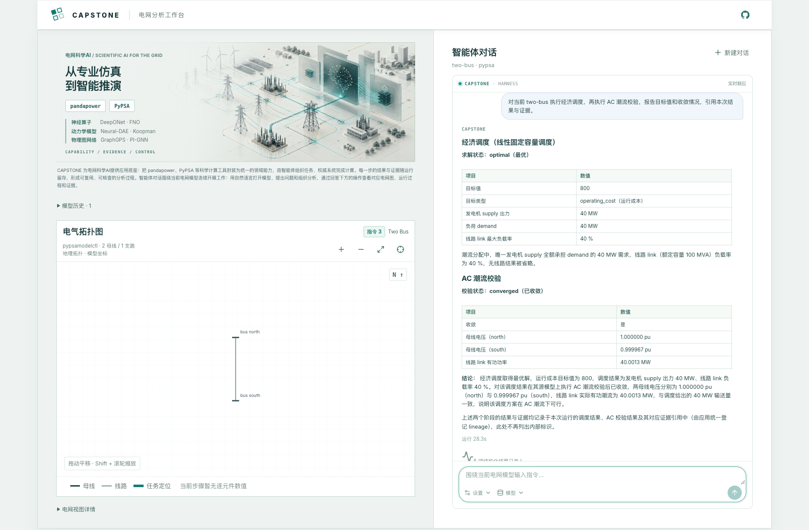

# Capstone Agent Framework

English | [简体中文](README.zh-CN.md) | [Try the live demo](https://capstone-app-production-975e.up.railway.app/)

**Analyze power grids through an agent conversation.**

Capstone brings natural-language instructions, a grid model, and analysis results into one workspace. Ask the agent to inspect a network, run a calculation, or investigate a result. The agent selects published domain tools; pandapower and PyPSA supply the model facts and calculations. Calculation results and their evidence remain available alongside the conversation.


## Start with a question

Open the [demo](https://capstone-app-production-975e.up.railway.app/) or run the App locally. The root page opens the agent conversation directly. Use the **Model** menu or a natural-language instruction to select a registered grid model, then ask questions about that model.

For an IEEE-39 analysis, try a sequence like this:

```text
List the registered pandapower grid models.
Open the ieee39 grid model.
Run an AC power flow and report convergence and total active-power losses.
Using those results, find the three lines with the highest loading.
Show their endpoint buses and the results and evidence supporting the answer.
```

Continue in the same conversation to inspect results or refine the analysis. Each instruction is bound to a model context and run. The **New conversation** action creates a separate Thread; its URL lets you return to it after a page refresh.

The conversation is the primary interface. Registered cases remain available as guided workflows and validation fixtures; the earlier case-library page is at `/old`.

## What you can analyze

| Model family | Current conversation capabilities |
| --- | --- |
| pandapower | Registered model inspection, buses and branches, topology, AC/DC power flow, losses, loading, model-constraint checks, and N−1 analysis |
| PyPSA | Registered model inspection and demand derivation, fixed-capacity economic dispatch, unit commitment, rolling storage dispatch, congested OPF, registered outage security dispatch, and post-dispatch AC validation |

Available operations depend on the selected model and its published capability contracts. The model menu reports when a complete topology is unavailable. See the [pandapower capability matrix](configs/capabilities/pandapower-3.4.0-static-analysis.json), [PyPSA modeling catalog](configs/capabilities/pypsa-1.3.0-modeling.json), and [PyPSA operations catalog](configs/capabilities/pypsa-1.3.0-power-operations.json) for executable scope.

For example, select the PyPSA `two-bus` model and ask for economic dispatch followed by AC power-flow validation:



These screenshots show the live App displaying previously completed analyses. The numbers belong to those runs, rather than fixed answers or performance benchmarks.

## Inspect the answer, calculation, and evidence

An answer has more context than its text. Its actions let you open the corresponding grid view, inspect admitted structured results, read evidence, and review the execution steps. The diagram supports pan, zoom, and component focus. Labels use model names with `bus`, `line`, and `trafo` prefixes; PyPSA links use `link`.

Numerical overlays use results admitted for the matching model revision and run. Missing values stay neutral. A line-loading color scale describes the returned values; a constraint assessment determines whether a limit is exceeded.

Model facts and numerical claims come from the registered authority. Informational answers, such as a model catalog, do not create calculation evidence. Results, reports, and evidence can be revisited through the API; the browser receives bounded projections from private storage.

## Run locally

You need Python 3.12+, `uv`, Docker Compose, Node.js 22.19+, and npm. For a fresh checkout:

```sh
git clone https://github.com/uukuguy/capstone.git
cd capstone
make setup
make install-pi
make install-pypsa-models
cp deploy/local.env.example deploy/local.env
```

Edit the ignored `deploy/local.env` and replace the example database, storage, operator, and Provider credentials. Keep runtime selectors consistent with the [shared host runtime profile](configs/runtime/host-runtime-v1.json). Provider credentials stay in backend configuration; normal agent conversations use the configured LLM and may incur Provider charges. See the [runbook](docs/RUNBOOK.md#hosted-app-and-deployment) for configuration.

Start the API, pandapower worker, PyPSA worker, and App with the checked-in entrypoint:

```sh
make capstone-local-rebuild
```

Open `http://127.0.0.1:5173/`. Local Compose enables direct conversation access without a browser token. The rebuild checks dependencies and readiness, verifies that API and both workers use the same image, and starts the Vite App when needed. It reuses verified local PyPSA model assets. Run it again after API, worker, or App source changes.

The App also listens on the LAN by default: a phone on the same network can open `http://<computer-lan-ip>:5173/`. Set `CAPSTONE_APP_HOST=127.0.0.1` for computer-only access. Use `make capstone-app-dev` when you want the Vite process in the foreground.

## How the framework supports the conversation

```text
Application → Domain Pack → Kernel → registered Authority
```

| Layer | Responsibility |
| --- | --- |
| Application | Select model families, capability bindings and Providers; expose the conversation, API, CLI, and answer views |
| Domain Pack | Own semantic tools, contracts, policy, guides, execution, and result/evidence admission |
| Kernel | Manage turns, bounded context, trajectories, artifacts, and replay |
| Authority | Access registered models, perform calculations or retrieve source-backed facts, and produce results and evidence |

The agent calls only published, allowlisted semantic tools with exact contracts. Raw pandapower/PyPSA objects, arbitrary code, shell commands, and generic file access stay outside the model-facing interface. Domains return explicit result and evidence references. The Kernel remains domain-neutral, so other applications can use separately installable Domain Packs and registered authorities.

The repository also contains PyPSA capacity-planning and sector-coupling Domain Packs. The current hosted PyPSA conversation selects modeling and power operations. See the [framework architecture](docs/architecture/capstone-framework.md) for composition and the [Domain Pack onboarding guide](docs/guides/domain-pack-onboarding.md) for extension.

## CLI and compatibility entry points

The CLI remains useful for automation and focused checks. After setup, run an offline pandapower query:

```sh
make doctor
make run QUESTION="IEEE-39节点系统中线路11连接哪两个母线?"
```

For LLM orchestration, configure the CLI Provider as described in the [runbook](docs/RUNBOOK.md#llm-配置与-pi-rpc-路径), then use:

```sh
make run-llm QUESTION="对 IEEE-39 执行交流潮流，并报告有功损耗。"
```

`grid-agent` remains the pandapower compatibility CLI. Its answer, report, and stdout contracts are documented in the [pandapower application guide](docs/PANDAPOWER-APPLICATION.md). The unified `capstone-agent` CLI and guided-case commands are documented in the [runbook](docs/RUNBOOK.md#capstone-统一客户端). Deterministic scripted fixtures support offline validation; they are separate from ordinary LLM conversation.

## Develop and deploy

Use local Compose plus Vite for iteration, cloud development for remote integration checks, and demo for verified user-trial releases. Cloud development and demo have separate databases, artifact storage, credentials, and public origins. Demo promotion uses the exact source revision or artifact verified in cloud development.

Focused App checks are `make test-capstone-app` and `make build-capstone-app`. Repository offline gates are:

```sh
make doctor
make test
make test-e2e
make validate
```

Provider validation is a separate, explicitly authorized check. Deployment procedures and runtime configuration belong to the operational guides:

- [Development and release lifecycle](docs/architecture/capstone-development-lifecycle.md)
- [Railway deployment](deploy/railway/README.md)
- [Cloud Run + Vercel deployment](deploy/cloud-run/README.md)
- [Runbook](docs/RUNBOOK.md)
- [Current project state](docs/status/CURRENT-STATE.md)
