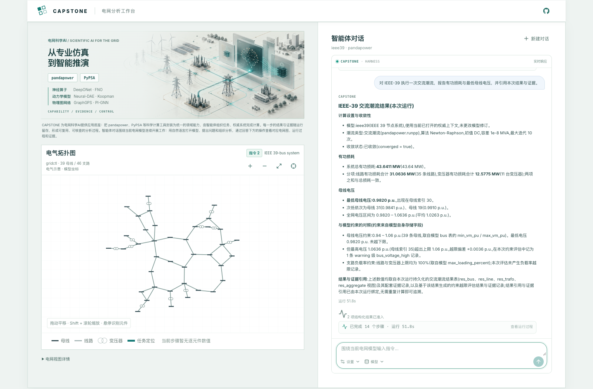
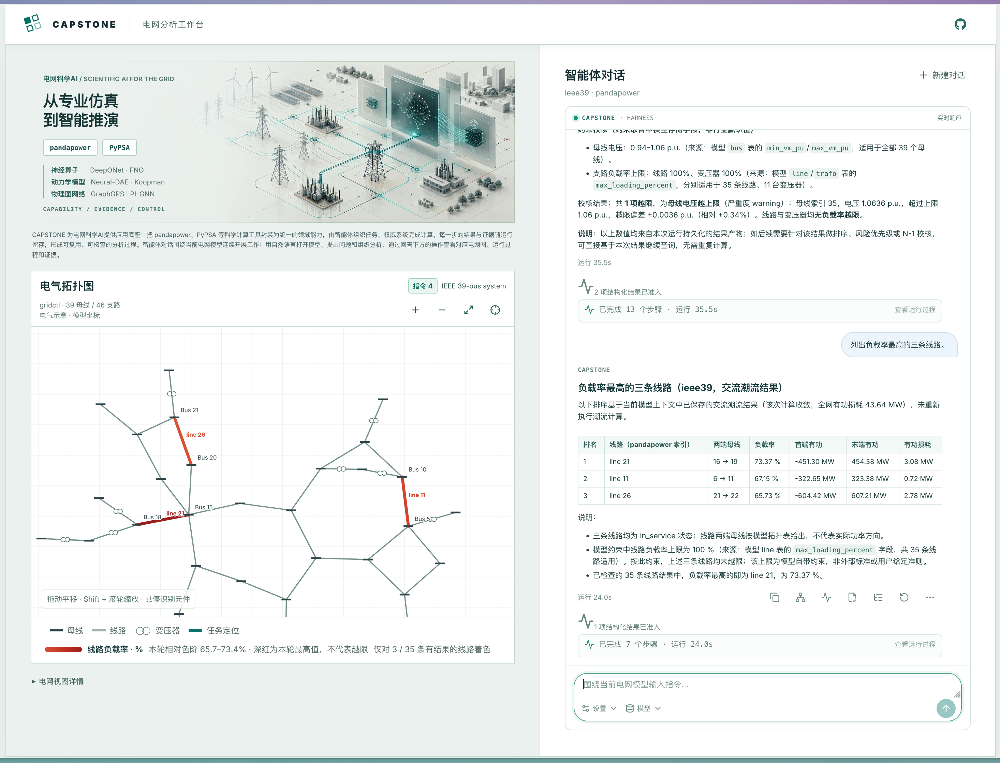

# Capstone Agent Framework

简体中文 | [English](README.md) | [打开在线 Demo](https://capstone-app-production-975e.up.railway.app/)

**连接智能体推理、领域能力、权威计算与可核查证据。**

Capstone 是面向已登记业务系统与科学计算系统的领域中立智能体框架。应用选择 Domain Pack 和权威系统，智能体组合其中已发布的语义工具，权威系统负责模型事实与计算。框架将结果、证据和模型修订绑定到每次运行，再通过对话、报告和交互视图呈现。

首个正式应用是**通过智能体对话开展电网静态分析**。工作台连接 pandapower 与 PyPSA 模型，支持连续分析：提出问题、执行领域工具、检查回答，再在电气拓扑图上定位相关元件。

设计遵循四个原则：

- **以契约组合能力。** 工具描述可复用的领域动作；选定的 Domain Pack 提供 schema、策略和指南。
- **由权威系统产生事实。** 登记系统访问模型、执行计算、产生结果数据集与证据；智能体组织分析并解释返回的事实。
- **Kernel 保持领域中立。** 上下文、步骤、执行轨迹、工件和回放属于共享框架服务；领域语义保留在独立安装的包中。
- **回答关联模型与证据。** 已准入引用保留运行和修订来源，使 App 能联动回答、结果表、拓扑图和执行记录。



上图来自在线 App 对已完成 IEEE-39 分析的回看，数值属于对应运行。

## 架构与执行机制

四层结构规定职责归属和依赖方向：


| 层 | 负责什么 |
| --- | --- |
| Application | 选择配置、领域绑定与 Provider；拥有公开对话、API、CLI 和兼容输出 |
| Domain Pack | 拥有语义工具、契约、策略、指南、执行、领域状态、结果与证据准入，以及投影 |
| Kernel | 组合选定能力；管理受限上下文、步骤、轨迹、类型化提交、工件与回放 |
| Registered Authority | 拥有模型访问、修订、计算或来源事实、结果数据集与证据 |

职责图不要求调用或导入逐层经过每个相邻层。实际执行时，**Application 进入 Kernel 生命周期**，Kernel 调用**注入的 Domain Pack 执行器**，由执行器访问权威系统。结果返回时，**Domain Pack 准入并投影权威结果**，Kernel 提交类型化状态，Application 呈现回答和视图。Kernel 不导入权威系统的实现。

智能体看到的是白名单中的语义工具及其明确契约。原始 pandapower/PyPSA 对象、任意 Python、shell 命令和通用文件访问位于这一接口之外。数值结论通过登记权威系统的契约返回；结果和证据引用必须经过当前运行与所需模型修订的准入检查，模型写出的引用本身不能确立证据。模型目录等信息性回答不创建计算证据。

契约与生命周期见[框架架构](docs/architecture/capstone-framework.md)，首个应用的权威边界见 [pandapower 能力组合架构](docs/architecture/pandapower-capability-composition.md)。

## 领域包接入与组合

Domain Pack 通过公开 Kernel SPI，封装一个领域的工具目录、schema、策略、指南、执行器、权威适配器、状态和结果投影。Application Profile 选择具名绑定和工具前缀。各绑定拥有自己的领域状态和凭据范围；通用输出将框架 `core` 与 `domains.<binding_id>` 分开。

当前 [PyPSA Application Profile](packages/pypsa-agent/src/pypsa_agent/profile.py) 展示了实际组合方式：

| 绑定 | Domain Pack | 工具前缀 | 职责 |
| --- | --- | --- | --- |
| `source` | PyPSA 网络建模 | `pypsa_model_` | 检查登记模型，派生模型修订 |
| `operations` | PyPSA 运行计算 | `pypsa_ops_` | 执行调度、运行优化和交流潮流校验 |

应用显式授权运行计算绑定使用来自建模绑定的类型化模型引用。来源权威系统校验模型修订，交接收据持久化以支持回放，目标绑定准入引用后再执行。组合领域包不会自动共享原始 Network、凭据或可变状态。

仓库还提供 PyPSA 容量规划与行业耦合包。这些能力分别选择接入；当前托管的 PyPSA 对话绑定网络建模和运行计算。只读库存参考包则在电网领域之外验证同一 SPI。

新增领域时，登记权威系统契约，基于公开 SPI 实现独立安装的领域包，再在应用中选择绑定与所需引用授权。接入验证覆盖打包资源、契约、执行、结果与证据准入，以及真实权威系统下的回放。[Domain Pack 接入指南](docs/guides/domain-pack-onboarding.md) 给出实现步骤与一致性检查。

## 从一句指令开始

打开[在线 Demo](https://capstone-app-production-975e.up.railway.app/)，或在本地运行 App。首页直接进入智能体对话。在**模型**菜单中选择已登记的电网模型，也可以通过自然语言打开模型，然后围绕它提出分析请求。

例如，分析 IEEE-39 时可以连续发送：

```text
有哪些 pandapower 的电网模型？
打开 ieee39 电网模型。
执行一次交流潮流，报告收敛状态和全网有功损耗。
基于刚才的结果，筛查负载率最高的三条线路。
查看这些线路的端点母线，以及支持回答的结果与证据。
```

在同一段对话中继续追问结果或细化分析。每条指令都绑定到一个模型上下文和运行。**新建对话**会创建独立的 Thread；保存其链接后，刷新页面仍能回到同一段对话。

**Capstone** 模式先由模型识别专业目标和通用目标：专业目标使用启用的 Domain Pack，
通用目标委托给隔离运行的原生 Pi 智能体。**Pi**（纯 Pi）模式先选择相关公共业务背景，再把任务交给同一个执行器。
Thread 空闲时可切换模式；会话历史、草稿和模型选择保留。
通用输出不创建权威系统结果或证据，实时新闻或天气仍需要实际可访问的信息源。
详见[共享执行器设计](docs/superpowers/specs/2026-10-09-capstone-pi-delegation-design.md)。
真实模型的回答质量需单独验收，离线检查不能代替这一验收。

使用 `/skills` 查看可用技能及执行角色，使用 `/skill:<name> <任务>` 选择本轮技能，
使用 `/context` 包含或排除公共背景。当前模型背景提供身份、版本与历史，不提供完整模型表。
托管的 PowerSkills/PowerMCP 资源分别使用原生 Pi 与专业适配器。
安装方法见[资源配置说明](docs/RUNBOOK.md#共享背景与角色资源)。

智能体对话是主要入口。Case 是独立模块；默认联合对话尚未装配 Case 执行服务。
已登记引导流程与验证样例保留在早期的 `/old` 入口。

## 可以分析什么

| 模型家族 | 当前对话提供的能力 |
| --- | --- |
| pandapower | 登记模型检查、母线与支路查询、拓扑、交流与直流潮流、网损、负载率、模型约束检查和 N−1 分析 |
| PyPSA | 登记模型检查与负荷派生、固定容量经济调度、机组启停、滚动储能调度、拥塞 OPF、登记故障集的安全调度，以及调度后的交流潮流校验 |

可用操作取决于选定模型和已发布的能力契约。完整拓扑不可用时，模型菜单会说明原因。准确的执行范围见 [pandapower 能力矩阵](configs/capabilities/pandapower-3.4.0-static-analysis.json)、[PyPSA 建模目录](configs/capabilities/pypsa-1.3.0-modeling.json)和 [PyPSA 运行计算目录](configs/capabilities/pypsa-1.3.0-power-operations.json)。

## 对话、结果与拓扑图联动

拓扑图呈现权威系统拥有的模型，并通过明确引用关联分析。App 接收受限的几何投影，与智能体读取的模型上下文分开；模型坐标保留登记的电气示意或地理结构。



让智能体“列出负载率最高的三条线路”。回答呈现排名、端点母线、功率与损耗，对应电网图突出本次分析的线路及负载率。截图展示已完成的分析，名称和数值保留该次运行记录的模型修订。

例如，得到“负载率最高的三条线路”后，可以沿关联视图检查：

1. 使用回答下方的电网图操作，回到该指令对应的模型视图。
2. 展开结构化分析结果；结果行包含元件引用时，点击该元件即可在拓扑图中定位。
3. 平移、缩放并查看元件。标注使用模型名称与 `bus`、`line`、`trafo` 前缀，PyPSA 的 Link 使用 `link`，图中名称与回答、结果表中的元件引用一致。
4. 查看证据和执行步骤，追溯计算过程。历史指令视图保留对应模型上下文，选择结果时恢复与它匹配的视图。

数值图层只使用匹配模型修订和当前运行的已准入结果，缺失值保持中性。线路负载率色阶描述返回数值的分布；是否越限由约束评估判断。模型变更与历史结果通过修订和运行引用保持可区分。

结果、报告和证据可经 API 回看；浏览器读取私有存储中的受限投影。对话、结果表与拓扑图因此具备共同的模型身份和证据链。

## 在本地运行

需要 Python 3.12+、`uv`、Docker Compose、Node.js 22.19+ 和 npm。首次检出仓库时执行：

```sh
git clone https://github.com/uukuguy/capstone.git
cd capstone
make setup
make install-pi
make install-pypsa-models
cp deploy/local.env.example deploy/local.env
```

编辑 Git 忽略的 `deploy/local.env`，替换数据库、存储、操作员和 Provider 的示例凭据。运行时选择项应与[共享宿主运行配置](configs/runtime/host-runtime-v1.json)一致。Provider 凭据仅保留在后端配置中；普通智能体对话使用已配置的 LLM，可能产生 Provider 费用。具体配置见[运行手册](docs/RUNBOOK.md#hosted-app-and-deployment)。

使用仓库统一入口启动 API、pandapower worker、PyPSA worker 和 App：

```sh
make capstone-local-rebuild
```

打开 `http://127.0.0.1:5173/`。本地 Compose 直接开放对话访问，无需浏览器令牌。重建入口检查依赖与服务就绪状态，确认 API 和两个 worker 使用同一镜像，并在需要时启动 Vite App。它复用本地已校验的 PyPSA 模型资产。修改 API、worker 或 App 源码后，再运行这一入口。

App 默认也监听局域网接口，同一网络中的手机可打开 `http://<电脑局域网 IP>:5173/`。设置 `CAPSTONE_APP_HOST=127.0.0.1` 可限制为本机访问。需要在前台查看 Vite 日志时，使用 `make capstone-app-dev`。

需要用独立数据测试干净的 demo 源码时，使用 `CAPSTONE_DEMO_SOURCE_DIR=/path/to/demo-checkout make capstone-demo-local-rebuild`。该 App 使用 15173 端口，API 使用 18767 端口。Provider 访问在独立受保护的 `deploy/demo-local.env` 中配置。详见[运行手册](docs/RUNBOOK.md#isolated-local-demo)。

## CLI 与兼容入口

CLI 可用于自动化和定向检查。完成安装后，可执行不调用 Provider 的 pandapower 查询：

```sh
make doctor
make run QUESTION="IEEE-39节点系统中线路11连接哪两个母线?"
```

需要 LLM 编排时，先按[运行手册](docs/RUNBOOK.md#llm-配置与-pi-rpc-路径)配置 CLI 的 Provider，再执行：

```sh
make run-llm QUESTION="对 IEEE-39 执行交流潮流，并报告有功损耗。"
```

`grid-agent` 保留为 pandapower 兼容 CLI，答案、报告和标准输出契约见 [pandapower 应用说明](docs/PANDAPOWER-APPLICATION.md)。统一的 `capstone-agent` CLI 和引导案例命令见[运行手册](docs/RUNBOOK.md#capstone-统一客户端)。确定性脚本样例用于离线验证，与普通 LLM 对话分开。

## 开发与部署

本地 Compose 加 Vite 用于日常迭代，cloud-dev 用于远端集成验证，demo 提供已验证的用户试用版本。cloud-dev 与 demo 分别使用自己的数据库、工件存储、凭据和公开域名。demo 晋级使用在 cloud-dev 验收过的同一源码版本或工件。

App 定向检查使用 `make test-capstone-app` 和 `make build-capstone-app`。仓库离线门禁为：

```sh
make doctor
make test
make test-e2e
make validate
```

Provider 验证是需要单独授权的检查。部署步骤和运行配置集中在操作文档中：

- [开发与发布生命周期](docs/architecture/capstone-development-lifecycle.md)
- [Railway 部署](deploy/railway/README.md)
- [Cloud Run + Vercel 部署](deploy/cloud-run/README.md)
- [运行手册](docs/RUNBOOK.md)
- [项目当前状态](docs/status/CURRENT-STATE.md)
