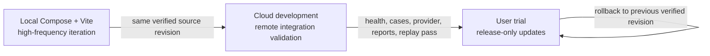

# Capstone development and release lifecycle

This document is the normative description of how Capstone is developed,
validated, and exposed to users. Railway service names, domains, credentials,
and deployment revisions are operational details owned by the [Railway
runbook](../../deploy/railway/README.md); this document defines the boundaries
that those details must preserve.

## Three execution lanes

Capstone has three lanes with different risk and data responsibilities:

| Lane | Purpose | Allowed change rate | User exposure |
| --- | --- | --- | --- |
| Local | High-frequency implementation and interaction testing | Every working-tree change | Developer or explicitly shared LAN only |
| Cloud development | Remote integration, worker wake-up, provider, App, and evidence validation | Development revisions after local gates | Internal testers and registered cases only |
| User trial | Stable release presented to users | Release tags or explicit promotion of a verified revision | Registered scripted cases; explicitly selected open Thread workbench |

The local lane is the fastest loop. The cloud-development lane is a remote
verification target, not a second production environment. The user-trial lane
is a release surface and must remain stable while development continues.

Cloud development must wake on access without an operator start. Its idle
policy balances the total bill, cold-start latency, task reliability and state
safety. A small measured database baseline is acceptable. Use platform
Serverless sleep for API and family workers after idle/wake validation. A
small static App can stay running to keep the first page reliable;
an idle process alone still retains billable memory. Workers must not keep
the stage awake by polling an empty ledger. Keep development push triggers
disabled when deployments are controlled explicitly. Retain database history,
the volume and artifact bucket. Manual deployment removal is a maintenance
action, not acceptance of automatic sleep. Validate the resumed stage and its
source identity before an acceptance tag. User trial remains independent.

## Server resource lifecycle

A durable Thread is a database record. It does not reserve a worker or keep a
model in memory. New Threads allocate execution resources only when work is
claimed. Each Attempt starts its runtime on demand and stops it on success,
failure or cancellation. RPC work has a finite deadline.

Model preparation is a bounded process cache. An Attempt pins its resources
during execution. Idle resources expire; capacity pressure evicts the least
recently used idle context. Active work must never be evicted. The worker also
sweeps when no new command arrives and closes its cache on shutdown. A later
Attempt prepares the registered model again after cache eviction.

The API limits concurrent Thread event subscriptions, including a limit for
each Thread. Disconnects and cancellation release subscription capacity. Worker
wake throttling for reads uses one process timestamp rather than a growing
session map. Each accepted Thread command sends a wake without that throttle,
so fast consecutive work cannot be stranded after the worker drains its queue.
Page entry waits for database and worker readiness and streams a bounded
component projection before enabling the workbench. Browser presence alone
does not retain compute. An inactive page releases subscriptions while keeping
its local workspace; renewed intent prepares components before writes resume.
Active tasks retain their lease. Recovery must preserve drafts and reading
position, without replacing a loaded conversation with a sleep screen.
The older compatibility host retains its bounded session pool and idle timeout.

Hosted images bake bounded Authority catalog exports for their immutable
registered models. The catalog payload is included in the installed artifact
identity and checked on startup, avoiding a full model-library reload on each
wake. Missing or mismatched metadata is fatal. Current model opening, mutable
Context state, results, evidence and live family availability keep their
existing Authority and admission checks. Family startup probes run concurrently.

The shared limits and deadlines belong to
[`configs/runtime/host-runtime-v1.json`](../../configs/runtime/host-runtime-v1.json).
The local and cloud stages must select the same tested policy. Private worker
health reports retained and active context counts so validation can confirm
resource release while a page remains open.

Resource eviction does not delete database history, results or evidence. These
records use persistent storage, which can grow independently of process memory.
Automatic record deletion requires a separate retention contract. Preserve
existing data while that contract is deferred.

Native resource profiles and installations have a separate persistent lifecycle.
The general Pi service retains accepted role revisions and immutable Linux
installations in its profile and resource volumes. A new image adds its tested
installation at the final runtime path; it does not relocate an existing venv or
replace accepted bytes. Profile revocation, absent bytes or incompatible executor
identity fails an old task explicitly. Process-cache eviction does not delete
these resources. Backend Authority resources are installed independently in that
backend image; task startup never installs dependencies. Stage isolation applies
to these private volumes as well as the ledger and artifact storage.

## Common foundation fixes across the two development lanes

The supported CI acceptance runtime is Python 3.12. Run the release checks on
Linux and macOS with that runtime. Do not add another Python version to the
matrix without an explicit support requirement and acceptance scope.

The local development and cloud-development path is one lane; the local demo
and cloud user-trial path is the other. Before deliberate parallel development,
record an accepted common foundation baseline. The present development/demo
feature differences do not themselves establish that alignment.

Public foundational fixes must reach both lanes. Intent contracts, goal
completion, answer admission, evidence linkage, failure diagnostics and common
response policy are shared behavior, not demo-specific patches. Maintain one
canonical implementation and common regression cases; application-owned adapters
may accommodate different feature sets without changing their shared semantics.

Record the common patch identity, its dependencies, each lane's target source
commit and verification receipts. A port must include its dependency closure.
Do not claim completion when one lane lacks the node, contract or runtime wiring
needed to activate a fix. If compatibility requires different semantics, resolve
the shared foundation before accepting the common repair. Independent feature
work must not duplicate these contracts or bypass Authority admission.

Local-dev is the daily development and integration entrypoint. After a local
source change, rebuild and validate the affected local-dev path. Local-demo
retains its last accepted source; do not update it for each development change.
When a user release is planned, freeze a tested main revision as the release
candidate and deploy it to local-demo for product acceptance. Keep the two
stages' databases, storage, runtime state and credentials separate. A shared fix
uses one canonical implementation, but its development acceptance does not
claim that demo has received it. Demo delivery requires its own release receipt.

Source propagation and cloud release are separate actions. Each hosted stage
retains its own required verification, exact role identity, promotion/rollback
rules and acceptance tag. A common fix does not authorize simultaneous cloud
deployment. An explicit local-only task must remain local-only.

Reader-facing environment identifiers are `local-dev`, `local-demo`, `cloud-dev`
and `cloud-demo`; keep product version and source revision alongside them. These
labels do not rename internal stages or change release permissions. Implement
the labels in a future authorized release, as requested by the user.

The accepted branch and merge workflow, common-fix return paths, two-step
baseline alignment and current environment identities belong to the fixed
[version-control register](../status/VERSION-CONTROL.md). Read and update that
register before branch integration, baseline changes, verification, release or
rollback. Development environments may enable isolated experimental features;
integration into main is distinct from user-trial acceptance. Native Pi and
skills work remains experimental until its recorded integration gates pass.

User feedback and AI-assisted repairs follow the normative
[Issue workflow](capstone-issue-workflow.md). GitHub Issues owns feedback and
discussion; PRs and verification receipts own implementation evidence; the
version-control register owns branch, baseline and release relationships.
The first delivery is command-driven: the current AI session may read,
communicate and repair when requested, and may remind at relevant work
boundaries. It does not enable scheduled or unattended execution, independent
paid model calls, automatic main merges or cloud deployments.

## Isolation invariants

Cloud development and user trial are separate deployment stages. They must not
share any of the following:

- PostgreSQL databases or `DATABASE_URL` values;
- artifact buckets, S3 credentials, or artifact endpoints;
- operator tokens;
- public API/App origins, allowed-origin lists, or domain bindings;
- mutable run, session, or evidence data.

API and worker within one stage share that stage's ledger and private artifact
storage. They must run the same tested backend source revision or the exact
same backend image digest. The App is a presentation client: its
`VITE_API_ORIGIN` contains only the selected API origin and never a token,
Provider key, bucket credential, or other secret.

Provider credentials are separate by default. The current function-validation
stage permits use of existing Provider credentials, as explicitly requested by
the user. This exception changes no database, bucket, operator-token or evidence
ownership. Provider secrets remain in protected backend environment variables.

The App reads the selected access mode from `/api/v1/thread-access`.
`CAPSTONE_THREAD_OPEN_ACCESS=true` opens the workbench and its Thread operations
without a browser token. Local Compose selects this mode by default; cloud
development selects it explicitly after local verification. Other deployments
retain operator access unless explicitly configured. The older public demo
credential remains limited to registered scripted cases and does not grant
Provider access. Ordinary conversation in open mode uses the worker's configured
Provider; it does not use that older demo credential.

## Promotion protocol

Normal local Compose and cloud development use the same versioned
[`host runtime profile`](../../configs/runtime/host-runtime-v1.json) and
`deploy/launch_host_runtime.py`. The profile owns application selection rules,
role commands, Provider/model selectors and startup dependencies. Environment
values supply stage-specific infrastructure and credentials. Conflicting
runtime selectors fail before application startup. API startup waits for both
family workers; subsequent catalog and admission checks refresh worker health.
The deployment receipt records contract, source artifact, installed artifact
and architecture without secrets. Contract and source identity must match
local acceptance and all cloud backend roles. Installed identity includes the
Authority catalog and must match within each stage, and across stages with the
same architecture. Generated-model floating-point revisions can differ on ARM
and x86; this does not relax exact model revision or snapshot checks.
Base images use pinned multi-platform digests and package installs use locks.
Capacity and infrastructure can differ; application semantics must not.
Bounded scripted validation is an explicit separate mode, not this profile.

Every user-trial update follows this sequence:

1. Run the smallest focused checks, then the required local gates. For API,
   worker, or App changes, rebuild with `make capstone-local-rebuild` so the
   running services use the current checkout.
2. Deploy the exact source revision to cloud development. Do not validate one
   revision and promote a later working-tree state.
3. Verify API readiness, App health, a registered scripted case, a Provider
   case when a separately authorized Provider key is configured, report
   generation, evidence replay, and API/worker revision identity.
4. Record the verified commit or image digest and promote that exact artifact
   to the user-trial stage under a release tag or an explicit release action.
5. Recheck the user-trial health endpoint and one registered public case.
6. If any release check fails, roll back the user-trial stage to its previous
   verified revision. Investigate the failure in cloud development or locally.

The user-trial stage must not follow ordinary development pushes. Its release
action is deliberate and reviewable. Cloud-development automatic deployment is
acceptable when it is limited to the development stage and still uses the
verification protocol before promotion.

## Change and credential rules

- Keep local runtime state, caches, model assets, and authentication state in
  ignored paths. Do not copy them into another lane or commit them.
- Put versioned runtime configuration in `configs/runtime/` and deployment
  variable names in the Railway examples. Put actual credentials only in the
  owning environment or ignored project state.
- Never put Provider or operator secrets in command arguments, logs, source,
  static App variables, simulator environments, or answer/evidence artifacts.
- Do not use cloud development to inspect, migrate, or repair user-trial data.
- Preserve unrelated work and user data while cleaning the repository; stage
  only task-owned files and never delete main-worktree `var/` data.
- Record a durable decision or deployment boundary in
  `docs/status/JOURNAL.md` when it changes how future work must proceed.

## Operating references

- [Repository agent contract](../../AGENTS.md) — mandatory constraints for
  agents and future changes.
- [Railway deployment runbook](../../deploy/railway/README.md) — service
  topology, variable checklist, health checks, and promotion operations.
- [Runbook](../RUNBOOK.md) — local rebuild, hosted App, and deployment entry
  points.
- [Current state](../status/CURRENT-STATE.md) and
  [next-session handoff](../status/RESUME-NEXT-SESSION.md) — volatile status;
  do not use them to redefine these invariants.
