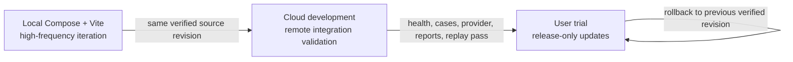

# Capstone development and release lifecycle

This document is the normative description of how Capstone is developed,
validated, and exposed to users. Railway service names, domains, credentials,
and deployment revisions are operational details owned by the [Railway
runbook](../../deploy/railway/README.md); this document defines the boundaries
that those details must preserve.

## Three execution lanes

Capstone has three lanes with different risk and data responsibilities:

| Lane | Purpose | Allowed change rate | User exposure |
| --- | --- | --- | --- |
| Local | High-frequency implementation and interaction testing | Every working-tree change | Developer or explicitly shared LAN only |
| Cloud development | Remote integration, worker wake-up, provider, App, and evidence validation | Development revisions after local gates | Internal testers and registered cases only |
| User trial | Stable release presented to users | Release tags or explicit promotion of a verified revision | Public registered scripted cases |

The local lane is the fastest loop. The cloud-development lane is a remote
verification target, not a second production environment. The user-trial lane
is a release surface and must remain stable while development continues.

## Isolation invariants

Cloud development and user trial are separate deployment stages. They must not
share any of the following:

- PostgreSQL databases or `DATABASE_URL` values;
- artifact buckets, S3 credentials, or artifact endpoints;
- operator tokens or Provider credentials;
- public API/App origins, allowed-origin lists, or domain bindings;
- mutable run, session, or evidence data.

API and worker within one stage share that stage's ledger and private artifact
storage. They must run the same tested backend source revision or the exact
same backend image digest. The App is a presentation client: its
`VITE_API_ORIGIN` contains only the selected API origin and never a token,
Provider key, bucket credential, or other secret.

The cloud-development App may use the public demonstration flow so its no-login
path can be tested, but its URL remains an internal test target and its
Provider key and limits are independent. Public demonstration credentials are
limited to registered scripted cases and never grant Provider access.

## Promotion protocol

Every user-trial update follows this sequence:

1. Run the smallest focused checks, then the required local gates. For API,
   worker, or App changes, rebuild with `make capstone-local-rebuild` so the
   running services use the current checkout.
2. Deploy the exact source revision to cloud development. Do not validate one
   revision and promote a later working-tree state.
3. Verify API readiness, App health, a registered scripted case, a Provider
   case when a separately authorized Provider key is configured, report
   generation, evidence replay, and API/worker revision identity.
4. Record the verified commit or image digest and promote that exact artifact
   to the user-trial stage under a release tag or an explicit release action.
5. Recheck the user-trial health endpoint and one registered public case.
6. If any release check fails, roll back the user-trial stage to its previous
   verified revision. Investigate the failure in cloud development or locally.

The user-trial stage must not follow ordinary development pushes. Its release
action is deliberate and reviewable. Cloud-development automatic deployment is
acceptable when it is limited to the development stage and still uses the
verification protocol before promotion.

## Change and credential rules

- Keep local runtime state, caches, model assets, and authentication state in
  ignored paths. Do not copy them into another lane or commit them.
- Put versioned runtime configuration in `configs/runtime/` and deployment
  variable names in the Railway examples. Put actual credentials only in the
  owning environment or ignored project state.
- Never put Provider or operator secrets in command arguments, logs, source,
  static App variables, simulator environments, or answer/evidence artifacts.
- Do not use cloud development to inspect, migrate, or repair user-trial data.
- Preserve unrelated work and user data while cleaning the repository; stage
  only task-owned files and never delete main-worktree `var/` data.
- Record a durable decision or deployment boundary in
  `docs/status/JOURNAL.md` when it changes how future work must proceed.

## Operating references

- [Repository agent contract](../../AGENTS.md) — mandatory constraints for
  agents and future changes.
- [Railway deployment runbook](../../deploy/railway/README.md) — service
  topology, variable checklist, health checks, and promotion operations.
- [Runbook](../RUNBOOK.md) — local rebuild, hosted App, and deployment entry
  points.
- [Current state](../status/CURRENT-STATE.md) and
  [next-session handoff](../status/RESUME-NEXT-SESSION.md) — volatile status;
  do not use them to redefine these invariants.
