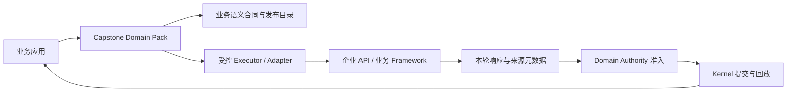

# Capstone 相近开源项目深度调研与选型建议

调研日期：2026-09-22。Capstone 基线：`1a788a491c77b20845bf09de30a7a08b460b1c12`。

> 历史选型快照：文中的 HTTP 接入建议已完成测试型实验，见[实验报告](../reviews/2026-09-22-http-authority-experiment.md)；其他候选仍是研究建议，当前实施状态以[优化计划](../superpowers/plans/2026-09-05-capstone-optimization.md)为准。

本报告与[设计与代码评审](2026-09-22-capstone-review.md)配套。范围为公开官方文档、官方仓库、选定源码及作者论文的交叉核查；不是对这些框架的完整代码审计，也未安装运行它们做性能或模型效果竞赛。本会话没有独立 Deep Research 产品工具，因此采用多轮联网检索、原始资料阅读、固定提交源码核查完成研究。

## 1. 定位与结论

本报告中的 **Capstone 能力包指企业业务 API、业务框架及其领域规则的封装**。它连接既有业务系统，例如 ERP/CRM 的业务服务，或 pandapower 这样的领域计算框架，提供受控的语义能力、执行适配和结果解释。一个能力包可以覆盖多个业务对象和操作；包边界宜跟随业务语义与权威归属，而非机械对应一个 API endpoint。

最直接的比较对象是“把既有业务系统能力供给 Agent 的集成层”：

- **Semantic Kernel Plugins**：已有业务代码和 OpenAPI 服务的插件化封装，是接口映射方式的直接对标。[官方 Plugins 文档](https://learn.microsoft.com/en-us/semantic-kernel/concepts/plugins/)
- **SAP CAP `@cap-js/mcp` / `@cap-js/agents`**：由业务框架的 service/entity/action 模型生成 MCP 工具或 Agent，是“企业业务 framework → Agent 能力”的直接对标。[MCP Adapter](https://cap.cloud.sap/docs/guides/ai/cap-mcp)、[Agents 插件](https://github.com/cap-js/agents)
- **Composio / Arcade**：业务 API 工具包、身份授权、调用适配与复用，是企业 API 接入方式的直接对标；需要区别其开源 SDK 与托管服务。[Composio](https://github.com/ComposioHQ/composio)、[Arcade](https://github.com/ArcadeAI/arcade-mcp)

Pydantic AI 的 `Capability` 是 Agent 行为扩展机制，LangGraph 是编排/恢复基础设施；它们只能作为 Capstone 内部机制的复用候选，不能凭相同术语判为 Domain Pack 的直接替代。AiiDA 提供计算溯源方面的补充参考。

研究判断：Capstone 应继续围绕“业务能力契约 + 注册权威执行 + 当前运行引用准入 + 应用装配”发展。**下一优先实验是单个 HTTP API 型业务能力包的接入验证**，检查现有 SPI 是否真的跨越本地 CLI 和领域 SDK；替换 Agent runtime 的实验优先级在其后。

本次没有找到可直接替换 Capstone 全部四层、同时默认满足其 current-run evidence 和两字段兼容输出要求的项目。这里的“没有找到”仅针对本报告核查的范围，不是对全部开源生态的否定判断。

## 2. 企业业务 API / framework 的直接对标

| 项目 | 封装对象 | 最值得借鉴的机制 | 和 Capstone 的关键差异 | 采用建议 |
| --- | --- | --- | --- | --- |
| **Semantic Kernel Plugins** | 原生业务代码、OpenAPI、MCP 服务 | 插件命名、函数元数据、OpenAPI 导入和认证 callback | 插件本身不定义 Capstone 的 authority/结果准入/领域输出合同 | 借鉴 Domain Pack 脚手架和接口导入；导入结果仍需业务审核 |
| **SAP CAP MCP / Agents** | 现有 CAP 业务 service、entity、action/function | 业务模型生成 schema、复用服务执行；Agent 插件可为服务生成工具和交互循环 | 依赖 CAP 业务框架；Capstone 目标是适配多个独立框架；生成工具不自动提供本轮证据合同 | **业务 framework 接入的首要参考** |
| **Composio** | 企业/SaaS 业务 API 与账户连接 | toolkit、auth config、connected account、用户会话及扩展业务逻辑 | SDK 开源不等于完整托管连接平台可自建；默认动态工具能力需收窄 | 借鉴连接与工具版本管理，可作为特定 Pack 的受控集成依赖 |
| **Arcade MCP** | 内部 API、定制业务集成和 OAuth 提供方 | 声明工具所需身份/secret，执行时提供凭据，框架无关服务 | standalone 与托管授权引擎的职责不同；业务 evidence 仍需自行实现 | 借鉴调用身份注入与错误适配；适合作为 authority 接入端候选 |
| **MCP Toolbox for Databases** | 企业数据源与预定义数据库操作 | source、tool、toolset 分离及连接管理 | 数据库工具不是完整业务 Domain Pack，绕开业务服务可能丢失业务规则 | 仅用于明确授权的数据权威，发布具业务含义的查询能力 |

表中功能依据：[Semantic Kernel OpenAPI](https://learn.microsoft.com/en-us/semantic-kernel/concepts/plugins/adding-openapi-plugins)、[CAP MCP](https://cap.cloud.sap/docs/guides/ai/cap-mcp)、[CAP Agents](https://github.com/cap-js/agents)、[Composio Toolkits](https://docs.composio.dev/reference/api-reference/toolkits)、[Arcade MCP](https://github.com/ArcadeAI/arcade-mcp)、[MCP Toolbox](https://github.com/googleapis/mcp-toolbox)。差异与采用建议为本报告的工程判断。

### 2.1 Semantic Kernel：业务接口插件化

官方允许从原生对象、OpenAPI 和 MCP 接入插件，保留函数说明与输入 schema；OpenAPI 调用支持认证 callback。源码的 `KernelPlugin.from_object` 与 `from_openapi` 体现了两类业务接入路径。[固定源码](https://github.com/microsoft/semantic-kernel/blob/ca40aa7226531d28a721d0ca0e451d0aaf86dafc/python/semantic_kernel/functions/kernel_plugin.py#L215)

对 Capstone 最有价值的是降低能力包制作成本：根据业务框架元数据或 OpenAPI 生成**候选合同**，由 Pack 作者定义语义、限制参数、选择允许操作，再发布。不能把所有接口机械暴露给模型；例如 `inventory.available.get` 应表达库存口径，内部究竟调用 REST、SDK 或多个业务接口由 authority adapter 决定。

### 2.2 SAP CAP：直接由企业业务框架供给能力

CAP MCP 插件通过服务注解暴露业务服务；源码还能按 action/function 生成工具并调用 `srv.send`，业务执行留在框架服务中。`@cap-js/agents` 进一步将既有 CAP 服务 Agent 化，提供开发用 mock LLM；其高级功能有 experimental 标记。[MCP 官方指南](https://cap.cloud.sap/docs/guides/ai/cap-mcp)、[动作执行源码](https://github.com/cap-js/mcp/blob/e72a79e9a4dee957fd95e4bf5fed596820373426/lib/tools/call.js#L97)、[Agents 仓库](https://github.com/cap-js/agents)

Capstone 可以借鉴“业务模型 → 能力定义 → 原业务执行链”的设计，把 framework adapter 的类型信息复用起来。需要补的是当前运行 receipt、来源身份和领域输出。CAP 自动生成的通用 query/call 暴露方式不应无条件复制到 Capstone；仍只发布选定语义能力。

适用边界需要写清：官方明确该 MCP adapter 面向 custom CAP application services，不能把它当作任意 SAP Application API 的通用代理路径。这限制的是该集成方案本身，不能据此推断所有 SAP 接入均不可行。[官方适用范围](https://cap.cloud.sap/docs/guides/ai/cap-mcp)

### 2.3 Composio / Arcade：业务连接和调用身份

Composio Toolkit 将服务操作、认证要求和 trigger 信息组织在一起；源码有按 `user_id`/toolkit 发起授权的入口。自定义扩展允许包裹已连接业务 API 并加入业务逻辑，但该扩展页目前标为 experimental。[Toolkits](https://docs.composio.dev/reference/api-reference/toolkits)、[固定源码](https://github.com/ComposioHQ/composio/blob/3a88a1a7397c5a5e88f0ed18649cdbd4506bb846/python/composio/core/models/toolkits.py#L112)、[Custom Toolkits](https://docs.composio.dev/docs/extending-sessions/custom-tools-and-toolkits)

Arcade 的工具定义包含 `requires_auth`、`requires_secrets` 和错误适配字段。开源 server 可 standalone 运行，但托管 OAuth/刷新等服务不能由 SDK 的 MIT 许可推断为完整本地能力。[定义源码](https://github.com/ArcadeAI/arcade-mcp/blob/6e4d67c95422ecdc23b6e045ca9c4837b0838d55/libs/arcade-mcp-server/arcade_mcp_server/mcp_app.py#L494)、[运行方式说明](https://github.com/ArcadeAI/arcade-mcp)

Capstone 的借鉴点是：连接配置、凭据句柄与模型输入分离；业务操作定义所需 scope；认证、限流和业务错误可区分。当前可先用测试凭据与单连接验证协议，不能因此自动把多租户、企业写审批或认证平台建设加入当前范围。

### 2.4 MCP Toolbox：业务数据访问的局部复用

MCP Toolbox 把数据源、工具与工具组分离，并提供连接池、认证和可观察性。其当前仓库已从 `genai-toolbox` 更名为 `mcp-toolbox`。[固定 README](https://github.com/googleapis/mcp-toolbox/blob/5700630c132d5e2fc2d38cf3e9ce1f9898bd757d/README.md)

如果某项业务的权威本身就是数据库服务，可以复用这样的执行层；如果业务事实由 ERP 服务规则生成，直接 SQL 可能绕过那些规则。应由 Domain Pack 确定权威归属，提供有业务意义的能力，不能让通用 SQL 工具替代领域合同。

### 2.5 面向企业接入的建议映射

这是运行调用与证据返回示意，不改变仓库四层源码依赖方向。HTTP/MCP/OpenAPI/SDK 是接入机制；Domain Pack 还需定义业务意义、允许操作、上下文影响和结果信任。通用接入协议不能单独完成这些职责。

## 3. 研究方法与可复查范围

筛选依据为七项：能力扩展方式、工具执行边界、类型与协议、运行状态和恢复、来源谱系、安装/集成成本、与 Capstone 当前范围的适配程度。

证据分为三类：官方文档说明的功能；固定提交源码中核实的接口；基于这些资料作出的 Capstone 适配判断。文档未证明的 current-run 准入能力标记为“需自建”，不据此断言上游不能实现。

固定源码核查点：

| 项目 | 本轮读取的源码 | 确认的机制 | 对 Capstone 的含义 |
| --- | --- | --- | --- |
| Pydantic AI | [AbstractToolset](https://github.com/pydantic/pydantic-ai/blob/0783896994c94a0eb270f5c9e20a0cffaa2a249d/pydantic_ai_slim/pydantic_ai/toolsets/abstract.py#L86) | 列举工具、参数验证、调用工具；durable 使用稳定 toolset ID | 可承接已发布工具目录，执行仍须委托 Domain executor |
| Pydantic AI | [CombinedCapability](https://github.com/pydantic/pydantic-ai/blob/0783896994c94a0eb270f5c9e20a0cffaa2a249d/pydantic_ai_slim/pydantic_ai/capabilities/combined.py#L53) | 能力组合与 agent/run 绑定；组合顺序和重绑定有实际复杂度 | 能力打包无需再造，但不能把任意扩展自动视为可信 Domain Pack |
| LangGraph | [BaseCheckpointSaver](https://github.com/langchain-ai/langgraph/blob/49cce0ca852be4cfb567a1cbe0e511ff325a1682/libs/checkpoint/langgraph/checkpoint/base/__init__.py#L177) | `put` 存完整检查点，`put_writes` 存关联步骤写入 | 借鉴后端接口与恢复合同；checkpoint 不自动成为领域证据 |
| AiiDA | [NodeCaching](https://github.com/aiidateam/aiida-core/blob/7573bc0ce1e23ad4824ad31c237c43a40a99dd81/src/aiida/orm/nodes/caching.py#L17) | 缓存哈希覆盖节点属性、repository hash 等，另有缓存来源标识 | 内容身份、来源关系和复用许可应分别表达 |
| Microsoft Agent Framework | [CheckpointStorage](https://github.com/microsoft/agent-framework/blob/98a982a147212424d766ed993e6ecda13abe5faf/python/packages/core/agent_framework/_workflows/_checkpoint.py#L134) | 持久化 Protocol；File 后端包含受限反序列化策略 | 可借鉴存储替换与兼容测试；不应直接复制其对象序列化模型 |

以上是接口和相关实现抽查，不代表完整审计每个仓库。所有运行性能、可移植性和迁移成本仍需后续实验证明。

## 4. 底层机制补充比较：不作为企业能力包的直接替代

| 项目 | 与 Capstone 的相近部分 | 现成优势 | Capstone 仍需承担的工作 | 本项目建议 |
| --- | --- | --- | --- | --- |
| **Pydantic AI** | 类型化工具、依赖注入、Agent runtime | Runner/Toolset 机制、可替换模型、durable 集成 | Domain Pack 发布合同、authority 限制、run/turn 引用准入与答案提交 | 业务 API 接入验证后，再评估 Runner 复用 |
| **LangGraph** | 有状态控制器、步骤执行、恢复 | checkpoint/store、pending writes、interrupt、重放与分支 | 领域状态语义、结果证明、事实和文本的关系 | **借鉴恢复合同；真实需要分支恢复时再集成** |
| **AiiDA** | 确定性计算、输入输出、可追踪结果 | Data/Calculation/Workflow 图、哈希与计算复用 | 自然语言工具目录、模型边界、答案交付 | **第一优先借鉴溯源模型；暂不引入完整基础设施** |
| **Microsoft Agent Framework** | 应用装配、工具、工作流、状态 | Python/.NET 生态、执行器与 checkpoint 接口 | 业务 authority 准入及 Capstone 输出契约 | 未来 .NET 或微软生态集成时重点评估 |
| **Google ADK** | 工具、Session、Artifact、Agent lifecycle | FunctionTool、版本化 artifact、会话/用户作用域 | 内容摘要、authority 身份、当前运行准入 | 借鉴作用域与工件服务划分 |
| **Haystack** | 组件组合、工具包、业务查询管道 | Pipeline/Agent、PipelineTool、文档检索组合 | 仿真结果谱系、run 绑定、提交规则 | 文档检索领域更值得使用；不作为当前网格应用整体替代 |
| **LlamaAgents / Agent Workflows** | 事件、步骤、状态与流程装配 | async event-driven workflows、可插拔持久化、服务封装 | 权威边界与证据准入 | 未来文档业务或异步工作流的候选 |

功能依据分别来自：[Pydantic AI](https://pydantic.dev/docs/ai/capabilities/overview/)、[LangGraph](https://docs.langchain.com/oss/python/langgraph/persistence)、[AiiDA](https://aiida.readthedocs.io/projects/aiida-core/en/stable/topics/provenance/implementation.html)、[Microsoft Agent Framework](https://learn.microsoft.com/en-us/agent-framework/workflows/checkpoints)、[ADK](https://adk.dev/artifacts/)、[Haystack](https://docs.haystack.deepset.ai/docs/agent)、[LlamaAgents](https://github.com/run-llama/llama-agents/blob/b81a735e4e9e384b08dd26a975b43332180e996c/README.md)。最后两列是本报告的适配判断。

### 4.1 Pydantic AI：Agent 运行机制复用

官方扩展模型已经把工具、指令、生命周期钩子等组织为可组合能力；Toolset 可以复用、组合和过滤。它与 Domain Pack 存在明显重叠，但 Domain Pack 还包含权威适配、结果准入和领域输出合同，二者不能直接等同。[Capability](https://pydantic.dev/docs/ai/capabilities/overview/)、[Toolsets](https://pydantic.dev/docs/ai/tools-toolsets/toolsets/)

durable execution 已有外部引擎接入与公开 backend builder。官方明确区分单次运行的故障恢复和聊天线程保存；这个区分适合用于整理 Capstone 的 session、context ledger 与 trajectory 责任。[Durable execution](https://pydantic.dev/docs/ai/capabilities/durable_execution/overview/)、[Backend builder](https://pydantic.dev/docs/ai/capabilities/durable_execution/backends/)

**建议映射**：Capstone 已发布目录 → 自定义 Toolset；调用 → 现有 executor；模型完成 → Capstone TurnController；证据准入与 answer commit 保留现有实现。不要启用与当前产品合同冲突的通用 shell/filesystem 能力。迁移可能减少 Python/Node/Pi 之间的适配与补丁维护，尚无本轮实测数据证明一定能降低总成本。

### 4.2 LangGraph：学习恢复边界，不把检查点当证据

LangGraph 区分 thread checkpoint 和跨 thread store；步骤级 pending writes 支持失败后保留已完成节点的结果。它也区分不同持久化模式的时延和恢复保证。[Persistence](https://docs.langchain.com/oss/python/langgraph/persistence)、[Checkpointers](https://docs.langchain.com/oss/python/langgraph/checkpointers)

**可借鉴**：公开且可测试的存储 Protocol、checkpoint 身份、步骤写入与完整提交的关系、恢复一致性测试。Capstone 当前主要是顺序问题处理，应先验证真实业务是否需要图编排。引入后必须指定唯一权威：外部图状态控制调度，Capstone ledger 控制已提交答案和已准入引用，避免两份互相竞争的业务真相。

### 4.3 AiiDA：更接近“证据来自计算”的核心目标

AiiDA 用不同节点与连接关系区分数据生成和工作流组织。缓存复用有显式来源；哈希能识别部分输入/实现变化，但其文档也讨论哈希策略的限制，不能理解为任意软件环境下的绝对重复性证明。[Provenance implementation](https://aiida.readthedocs.io/projects/aiida-core/en/stable/topics/provenance/implementation.html)、[Caching and hashing](https://aiida.readthedocs.io/projects/aiida-core/en/stable/topics/provenance/caching.html)

**建议映射**：输入模型 revision → 计算 invocation → result → evidence → answer 引用。若以后复用历史计算，必须由 authority 在新 run 中明确再准入并记录来源，不能仅凭内容 hash 相同就把历史 evidence 当成本轮证据。当前应先参考其数据模型；引入整个科研计算工作流平台会增加并非当前目标所需的部署与运维。

### 4.4 其余四个框架的边界

Microsoft Agent Framework 的 checkpoint 在执行器超步边界保存状态、消息及待处理请求，适合借鉴类型化 workflow state。其文件后端使用 JSON 外层和对象序列化机制，已有类型限制；Capstone 的 JSON/摘要边界不宜为复用存储而扩大为任意对象反序列化。[文档](https://learn.microsoft.com/en-us/agent-framework/workflows/checkpoints)、[固定源码](https://github.com/microsoft/agent-framework/blob/98a982a147212424d766ed993e6ecda13abe5faf/python/packages/core/agent_framework/_workflows/_checkpoint.py#L505)

ADK 的 artifact 是带会话或用户作用域的命名版本化数据。可以参考其生命周期划分，但 artifact 存在和版本号并不能证明计算结果有效，也不能替代 Capstone 的 digest 与 authority admission。[Artifacts](https://adk.dev/artifacts/)

Haystack 的 `PipelineTool` 可以将整个 Pipeline 的选定输入输出封装成一个工具。这适合未来“领域能力内部包含检索、清洗和查询”的应用装配，模型仍只应看到发布的语义接口。[PipelineTool](https://docs.haystack.deepset.ai/docs/pipelinetool)

LlamaAgents 的 Workflows 将流程表示为接收/发出类型化事件的异步步骤，并允许渐进增加持久化或服务层。调研中旧 `run-llama/workflows-py` URL 已跳转到 `run-llama/llama-agents`，说明选型应锁定具体提交和包，不能沿用旧名称推断当前能力。[当前官方仓库](https://github.com/run-llama/llama-agents)

## 5. 电网领域相似项目：避免把同名项目和论文当成同一个开源实现

| 项目 | 核实情况 | 与当前应用的关系 | 如何使用该资料 |
| --- | --- | --- | --- |
| **GridMind，Argonne 作者论文** | 论文描述 LLM、多领域分析 Agent、确定性求解器和结构化结果；本轮未确认对应可用官方源码仓库 | ACOPF、contingency、共享分析上下文非常接近业务场景 | 作为研究对标，不计入已验证的开源替代品 |
| **X-GridAgent** | 作者论文描述 planning/coordination/action 三层与工具/数据源；本轮未确认官方开源实现 | 自然语言电网分析与工具编排相近 | 借鉴任务集与检索设计，不宣称已经有可复用代码 |
| **shikharmishra1/gridmind** | 公共源码、AGPL-3.0；README 描述 pandapower、LangChain Agent、可视化 | 同业务应用的公开实现，但不是上述 Argonne 论文的已确认源码 | 后续可比任务 UX；本轮未运行，不能由 README 推断可信度或生产成熟度 |
| **TenneT GridMind / LF Energy proposal** | 所读提案描述私有仓库及计划开源，是 ML 输入/输出/配置接口项目 | 属于同名不同定位项目 | 不能据这个提案把它写成已可安装的 Agent framework |

依据：[GridMind 作者论文](https://arxiv.org/abs/2509.02494)、[X-GridAgent 作者论文](https://arxiv.org/abs/2512.20789)、[公开 GridMind 仓库](https://github.com/shikharmishra1/gridmind)、[LF Energy 原始提案](https://github.com/lf-energy/tac/issues/750)。论文中的数值成绩没有在本地复现，本报告不拿它们与 Capstone 的不同任务集横向排名。

## 6. 开源许可与可复查时间点

下表是本次读取的仓库标识和许可证信息，不替代采用前对具体发行包、附带资源和依赖的检查。GitHub API 的 AiiDA license 字段返回 `NOASSERTION`，因此另外读取 `LICENSE.txt`，其中声明 MIT；没有沿用搜索结果猜测许可证。

| 项目 | 官方许可证来源 | 本轮主分支提交快照 |
| --- | --- | --- |
| Semantic Kernel | [MIT](https://github.com/microsoft/semantic-kernel) | `ca40aa7226531d28a721d0ca0e451d0aaf86dafc` |
| CAP MCP | [Apache-2.0](https://github.com/cap-js/mcp) | `e72a79e9a4dee957fd95e4bf5fed596820373426` |
| Composio SDK | [MIT](https://github.com/ComposioHQ/composio) | `3a88a1a7397c5a5e88f0ed18649cdbd4506bb846` |
| Arcade MCP | [MIT](https://github.com/ArcadeAI/arcade-mcp) | `6e4d67c95422ecdc23b6e045ca9c4837b0838d55` |
| MCP Toolbox | [Apache-2.0](https://github.com/googleapis/mcp-toolbox) | `5700630c132d5e2fc2d38cf3e9ce1f9898bd757d` |
| Pydantic AI | [MIT](https://github.com/pydantic/pydantic-ai) | `0783896994c94a0eb270f5c9e20a0cffaa2a249d` |
| LangGraph | [MIT](https://github.com/langchain-ai/langgraph) | `49cce0ca852be4cfb567a1cbe0e511ff325a1682` |
| AiiDA | [MIT / LICENSE.txt](https://github.com/aiidateam/aiida-core/blob/7573bc0ce1e23ad4824ad31c237c43a40a99dd81/LICENSE.txt) | `7573bc0ce1e23ad4824ad31c237c43a40a99dd81` |
| Microsoft Agent Framework | [MIT](https://github.com/microsoft/agent-framework) | `98a982a147212424d766ed993e6ecda13abe5faf` |
| Google ADK Python | [Apache-2.0](https://github.com/google/adk-python) | `ed758bbabf7a4ca76f13602e0e1cbb24c793abef` |
| Haystack | [Apache-2.0](https://github.com/deepset-ai/haystack) | `34960c9ea2bf80939b5c3b933f79912b639f2b35` |
| LlamaAgents | [MIT](https://github.com/run-llama/llama-agents) | `b81a735e4e9e384b08dd26a975b43332180e996c` |

表列仓库在查询时均非 archived；这只说明仓库状态，不等于生产稳定性、API 兼容承诺或已发布版本保证。主分支源码可能晚于发行版，实验前需要重新选择并固定实际可安装版本。另读了 `cap-js/agents` 的 README 与仓库元数据（Apache-2.0、非 archived），未把它列为已固定源码审计的对象。

补充：观测系统可考虑 Langfuse，但它属于 open-core，`ee/` 的许可不同于核心 MIT；也不承担领域事实准入。[官方许可证说明](https://github.com/langfuse/langfuse/blob/main/ee/LICENSE)。本轮仅作观测方向补充，不纳入主要替换选型。

## 7. 自研与复用的建议边界

| 保留 Capstone 所有权 | 可以实验替换的机制 | 替换成立的前提 |
| --- | --- | --- |
| DomainBinding、发布合同、authority 身份及 executor 策略 | Toolset 映射、模型循环、Provider transport | 工具目录和可执行权限不能扩大 |
| 当前 run/turn 引用准入、answer commit、兼容输出 | 外部 Runner 的事件接入 | final text 不绕过 TurnController；失败和取消语义不丢失 |
| 内容摘要、工件注册、结果与证据谱系 | 可选观测导出 | 观测失败不影响主答案，敏感信息不外泄 |
| 现行提交与 replay 合同 | 未来持久化后端 | 只有一个已提交状态源；必须证明崩溃恢复与历史运行兼容 |

避免同时迁移 runtime、存储格式和 Domain SPI，否则无法判断回归来自哪一层。OP08 strict arbitrary-JSON、OP13 segmented storage、多域路由和写操作治理仍按现有范围暂缓，本次研究不自动启动它们。

## 8. 最小对照实验与决策标准

**先验证企业 API 能力包。** 在现有 inventory conformance 的独立实验变体中，将注册权威换成 loopback HTTP 服务，保留 `inventory.*` 语义工具。响应提供 request ID、记录版本/ETag、采集时间和分页完整性信息；Domain Pack 持久化本轮 response receipt 并经 authority 准入。不选定第二正式业务领域，不连接实际企业账户。

验收重点：凭据及 endpoint 不能由模型选择；401/403、429、超时、响应 schema 漂移、部分分页不能伪装成完整业务成功；结果由业务 API/框架产生；两轮应用、报告隔离、replay 和干净安装保持有效。ETag 只作版本元数据，不能替代摘要或本轮采集记录。该实验将决定需要完善的是 Pack 模板、transport adapter 还是少量 SPI，而非预先大改 Kernel。

**随后才做可选 Runner 实验。** Pydantic AI 优先；只有业务确需图式恢复时再比较 LangGraph。使用 inventory conformance 与现有 scripted grid task，通过假模型或脚本模型完成，不需要 Provider 凭据。

1. 在独立实验适配包中实现现有 ProviderSession/Runner 接口，将发布目录映射为 Toolset；复用同一 DomainBinding、executor、authority 与提交控制器。
2. 两条运行路径使用同一问题和工具脚本，比较发布工具集合、输入校验、调用顺序、控制器 final text 提交及公开输出形状。
3. 测试错误关联 ID、错误 run 引用、非法工具、非零 authority 退出、超时、取消、报告失败；外部 runtime 不能弱化任何现有边界。
4. 在各自独立 run 中验证引用谱系和 replay 等价；不能要求含 run 身份的引用字符串跨运行逐字相同。离线答复不应制造 evidence。
5. 记录新增依赖、adapter 代码量、需要保留的 Pi 功能、启动时延、测试复杂度。只有证据显示维护负担下降且合同不退化，才提出迁移计划。

实验停止条件：必须把任意 callable/shell 暴露给模型；需要修改领域计算才能接入；两份持久化状态无法确定单一提交点；关键请求捕获、取消或引用验证无法保持。到此应记录不适配原因并保留当前实现。

总体建议是收敛 Capstone 的不可替代职责，用可复查实验检验复用价值。本轮不建议整体重写，也不把外部框架的宣传性能当作迁移收益。
