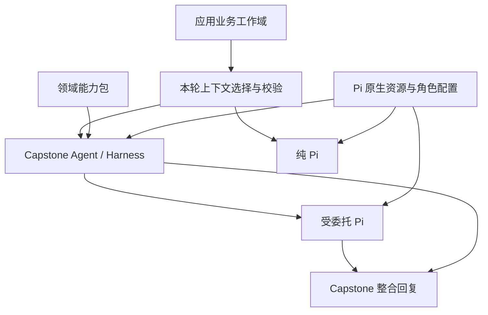

# 共享业务工作域、Pi 角色与 skills/MCP 接入设计

状态：2026-10-09 用户已批准按方案实施。实施进行中，尚未完成验收。
实施记录见[分任务计划](../plans/2026-10-09-business-workspace-agent-resources.md)。

用户指定 PowerSkills pandapower 与 PowerMCP 为实际接入样本，并要求验证它们对
Capstone Harness 的直接领域增强。固定版本的兼容性检查已确定一个具体路径：
在 gridctl Authority 内通过 PowerMCP 执行结构检查，经现有 analysis.run 结果契约
返回，保持模型版本和证据绑定。原生 Pi 的技能/MCP 试用与这项专业增强分别验收。

归属：[普通对话主线](../plans/2026-10-07-capstone-conversation-completion.md)。
延续[Pi 委托设计](2026-10-09-capstone-pi-delegation-design.md)和
[演进讨论记录](2026-10-07-capstone-core-evolution-discussion.md)。
本设计不启动讨论记录中的全部研究问题。

## 1. 目标与完成标准

用户在同一会话切换 Capstone / Pi 后，业务目标、当前模型、相关资料及
已有成果保持连续。任务仅取得所需背景，实际执行能力由当前角色的配置决定。
Capstone 和 Pi 都能使用 skills/MCP；领域能力包只在 Capstone Agent 内可见。

首个成功信号是：纯 Pi 收到“解析线路 11 的端点”时，能正确绑定会话内的
电网对象，并根据实际可用数据与工具处理。只有对象介绍时，应指出缺少线路数据；
获得授权的端点数据时，可以据此回答。不得自行用同名示例网络替代当前模型。
这是通用上下文能力，验收必须覆盖其他对象、指代和混合任务。

另一成功信号是：用户能看到本轮可用的 skills，明确选择一个，并知道它将由
Capstone 还是委托 Pi 执行。用户也能检查本轮业务资料范围。
斜杠命令必须服务这两项操作，不能仅增加一套菜单别名。

## 2. 已确认的边界

### 2.1 两种会话模式、三种 Pi 角色

| 执行角色 | 会话模式 | 配置与上下文 | 输出接收者 |
| --- | --- | --- | --- |
| `harness_engine` | Capstone | Harness 专业上下文、领域能力包及已接入的 skills/MCP | Capstone Agent |
| `delegated_pi` | Capstone | 委托目标、相关工作域投影、自身原生资源配置 | Capstone Agent 整合回复 |
| `direct_pi` | Pi | 用户任务、相关工作域投影、自身原生资源配置 | 用户 |

角色是执行身份，不新增第三个前端模式。受委托 Pi 与纯 Pi 可共用执行器及资源版本；
两者的任务生命周期、上下文范围和回复归属分别记录。
领域能力包的代码、策略、指南、内部工具目录和执行状态不进入后两种角色。

### 2.2 工作域与执行上下文

应用拥有会话业务工作域：目标、约束、已打开对象、当前对象、授权资料及用户可见成果。
各角色从中取得本轮相关投影，再组织自身的计划、工具调用、预算和执行状态。
业务背景不会授予工具权限，也不会使历史结果成为当前执行的证据。

保留[四层归属](../../architecture/capstone-framework.md)：
应用组织工作域和资源配置；Domain Pack 拥有领域语义、公共投影与专业准入；
Kernel 保持中性执行和引用契约；Authority 仍拥有事实、模型版本与证据。
工作域是应用已有 Thread/模型工作区的组合视图，不新增第五层所有权。

### 2.3 原生配置优先

沿用 Pi 的 skills、packages、extensions 和 settings 约定。
Capstone 接入层负责角色适用性、工具发布、资料授权与结果接收。
不自建另一种 SKILL.md 格式，也不直接加载开发者 HOME 中的全部资源。

## 3. 源码基线及差距

| 当前实现 | 已验证的行为 | 本设计需要补充 |
| --- | --- | --- |
| [intent_runtime.py](../../../packages/capstone-agent/src/capstone_agent/intent_runtime.py) | Capstone 识别器可见当前模型身份；直接 Pi 路径仅冻结历史消息 | 两种入口共用工作域投影；直接 Pi 增加语义上下文选择，不增加专业执行路由 |
| [pi_delegation.py](../../../packages/capstone-agent/src/capstone_agent/pi_delegation.py) | 严格 `/1` 请求只有消息与依赖结果，通用 JSON 禁止模型版本及 Authority 字段 | 独立、类型化的公共业务上下文；不能通过虚构历史消息绕开校验 |
| [general_pi_server.py](../../../packages/capstone-agent/src/capstone_agent/general_pi_server.py) | 原生任务 context.json 只有消息与依赖；每个任务有隔离目录 | 物化公共投影、受授权资源副本与加载收据 |
| [runtime_capabilities.py](../../../packages/capstone-agent/src/capstone_agent/runtime_capabilities.py) | 注册表记录 kind、id、version、source | 实际安装、解析、角色启用、工具可用状态及不可用原因 |
| [专业启动器](../../../packages/capability-agent-kernel/src/capability_agent/runtime/environment.py) | 禁止自动发现和原生通用工具 | 显式物化获准 skills 和适配工具，保持专业边界 |
| [ThreadFixtureApp.tsx](../../../packages/capstone-app/src/ThreadFixtureApp.tsx) | Pi 入口跳过模型控制解析，部分操作按模式直接禁用 | 公共操作目录按能力与当前状态决定可用性 |

本地固定版本 Pi 文档与源码还确认：skills 支持按需加载及 `/skill:name`；
MCP 通过扩展接入；RPC prompt 会处理扩展命令并展开技能与模板。
SDK 的 prompt 选项可关闭展开，但当前 RPC prompt 类型未公开该选项。
后续实现使用仓库固定版本验证，不以其他产品的命令表推断 Pi 行为。

## 4. 方案选择

| 方案 | 收益 | 代价与结论 |
| --- | --- | --- |
| 全面共用同一 Pi 配置及工作目录 | 初始接入少 | 混合执行状态和资源权限，无法保持三种角色边界；不采用 |
| Capstone 自建 skills/MCP 格式和管理器 | 可以完全控制 | 重复原生机制，开源资源需要长期改造；不采用 |
| 原生资源＋角色配置＋Capstone 接入层 | 可复用生态，同时保留专业契约 | 需要适配与真实加载验证；采用此方向 |

共享安装后的不可变资源；每个角色生成自己的原生配置和任务目录。
同一技能是否可用，由资源内容、工具要求、授权和角色适配共同决定。
不得把“安装成功”展示为“此角色可以执行”。

## 5. 业务工作域公共契约

### 5.1 工作域来源

复用现有 Thread、已打开模型集合、当前模型指针和历史消息。
新增目标、资料及可共享成果的引用，以应用账本为索引，不复制 Authority 数据库。
领域字段经所属公开投影提供；Kernel 和 App 通用组件不解析电网内部对象。

建议公共契约 `capstone-business-context/1`：

| 字段 | 内容 |
| --- | --- |
| `workspace_id`, `snapshot_id` | 会话工作域身份与不可变快照 |
| `history_cutoff` | 与所用历史相同的截止位置 |
| `selection` | `none`、`selected` 或 `needs_clarification`，及选取来源 |
| `object_refs` | 公共对象 ID、显示名、类型、公开版本、当前/历史关系、来源 |
| `goals`, `constraints` | 用户明确提出或确认的相关目标和约束，带原消息引用 |
| `materials` | 可读资料身份、类型、摘要、内容哈希、字节数、可用状态与用途 |
| `outcomes` | 已有成果的公共摘要、对象版本、来源和结果类别 |
| `coverage` | 已提供范围、未提供项及截断标记 |

模型推测出的意图只进入本轮选择记录，不静默写成持久业务目标。
公开版本通过宿主映射绑定真实版本；不携带内部模型引用、访问地址或凭据。
对象 ID 与历史消息关联保留，但不会把所有历史模型自动带入当前任务。

### 5.2 可共享的电网信息

第一阶段提供模型身份、版本、说明以及已经存在的公共资料。
后续新增数据投影时，由领域所有者定义并从 Authority 获得：例如设备表、
连接关系、单位、索引约定和运行断面说明。投影以 JSON/CSV 等普通数据形式提供，
附模式版本和来源，不传递 pandapowerNet、DataFrame 或私有存储路径。

例如 `line` 的元素 ID、展示编号和行位置必须有明确区别。
若“线路 11”不能按当前模型的索引约定唯一绑定，返回候选或请求澄清。
这一映射由公共数据定义，不能要求通用 Pi 猜测。

给 Pi 提供公共业务数据不需要让它安装领域能力包。后端投影可以经能力包的公共接口
产生；Pi 只收到普通数据及来源说明。导出数据副本只在获授权的任务范围可读。
缺少导出能力时，明确显示只有模型背景，不宣称已经具备完整电网分析能力。

### 5.3 资料与成果

小摘要进入模型上下文；大资料由宿主按资料 ID 物化到任务私有 `.context/resources/`。
此目录不自动作为 Pi 新产物上传。资料只读挂载或置于任务用户不可写的输入区。
任务目录不挂载业务宿主目录。宿主按 ID 解析授权，模型不能提交任意文件路径取数。

初始预算建议：工作域文本投影最多 24 KiB、16 个对象、8 份资料；
资料单份最多 4 MiB，总计最多 16 MiB。全请求仍受既有 256 KiB JSON 上限约束。
这些是版本化配置默认值；溢出按完整条目裁剪并报告，不截断半份结构化数据。
被明确选择的必要资料超过预算时，先要求缩小范围，不静默换成其他对象。

历史 Authority 结果保留公共来源身份，当前专业任务需要重新准入。
Pi 对导出副本的计算可产生独立分析产物，标明输入版本与运行配置；
它不写回当前业务模型，也不自动获得 Authority 结果身份。
涉及当前模型修改的任务仍由 Capstone 专业路径完成。

## 6. 按任务组合上下文

应用先冻结工作域快照，再把小型对象/资料索引和相关历史交给语义选择节点。
节点输出目标、对象引用和资料需求；应用校验范围并组装投影。
普通任务的执行器不收到业务对象索引。选择节点可见索引用于判断关联，
不能把识别提示和内部目录原样复制到回答执行上下文。

| 情况 | 执行任务的业务上下文 |
| --- | --- |
| 与会话业务无关的问答 | `selection=none`，只用相关对话 |
| 混合任务 | 为每个子目标分别选择资料；天气查询不自动携带整份网络 |
| 纯 Pi 的专业问题 | 当前或明确指代的对象、相关资料与成果 |
| “上次那个模型”等历史指代 | 对应历史对象与版本，不默认替换为当前模型 |
| 指代有多个候选 | 已知背景加澄清请求，不执行猜测出的业务操作 |

Capstone 复用并扩展现有意图节点，以逐目标投影供专业执行和委托使用。
纯 Pi 增加同一语义契约的上下文选择步骤，省略专业能力目录、领域计划与路由；
选好背景后，任务仍直接由 Pi 执行。与原有“直接入口跳过全部识别”相比，
这是明确的行为调整；它保留“直接入口不经过 Harness 专业执行”的边界。

选择器身份单独记录，可沿用当前模型，也可在将来替换为 Jev 或小模型。
禁止关键词分类及识别失败后的关键词兜底。识别失败时保留草稿/任务，返回可重试状态；
用户可明确选择“不带业务背景”发起新任务，但失败本身不代表其同意。

用户在输入框选择的资料形成显式包含/排除条件。排除优先；缺少必要资料时说明缺口。
语义判断可以选取额外的已授权相关资料，不能突破用户显式排除或访问范围。

## 7. 执行契约及重试

将请求升级为 `capstone-pi-task/2`，保留 `/1` 的身份、预算、消息和依赖字段，新增：

- `business_context`：上述有界投影；普通任务为显式空投影。
- `resource_profile`：已解析的配置版本和内容哈希，无凭据。
- `input`：`text` 或 `skill_invocation`，技能调用包含绑定资源 ID 与原始任务文本。

`/2` 使用专用 schema 校验公共版本等字段；不删除通用不可信 JSON 的保护规则。
结果中的来源身份仍由宿主发放。Pi 不能通过回传字段声称生成了专业证据。
结果收据增加输入投影与实际加载资源的哈希，并由宿主验证，不能依靠模型自报。

服务能力发现声明支持的 schema。携带业务背景或显式 skill 的任务不能降级成 `/1`
后丢掉字段继续执行。不需要新字段的旧任务可按旧配置继续恢复。

接受任务时固定：工作域快照、选择结果、对象版本、资源版本、角色、原始输入和预算。
重试复用快照；若所需资源或资料已撤销，返回明确失效状态。
新模型选择或新安装的技能只影响新任务。委托失败、取消和未知执行结果沿用既有协议，
不得因配置变化重复产生副作用。活动任务结束前不卸载其资源版本。

## 8. skills/MCP 的原生资源与接入层

### 8.1 单一资源来源，三份角色配置

资源来源和固定版本由应用管理，安装到受管理的不可变目录。
原生配置继续保存 Pi 已定义的 settings、packages、skills、extensions。
新增 Capstone 元数据仅引用这些资源，记录角色、所需能力及适配方式；
不复制技能内容或发明与原生 settings 同义的配置键。

现有 `configs/runtime/general-pi/` 保持通用默认配置入口。
新增版本化角色绑定文件放在 `configs/runtime/`；角色可引用共同原生资源集，
再形成明确的启用列表。安装产物和认证状态留在忽略目录。
配置优先级：固定资源版本 → 原生配置解析 → 角色选择 → 会话授权 → 本轮显式选择。
后层可缩小范围；扩大范围必须通过应用配置变更，不由任务文字完成。

启动时记录实际加载收据：Pi 版本、资源包版本/哈希、已发现 skills、工具 schema、
适配器版本、资源可读性及依赖状态。MCP 连接健康单独更新，保持与不可变 schema 身份区分。
目录至少区分 `installed`、`enabled`、`ready` 与不可用原因。

### 8.2 Capstone 直接使用 skills

| 技能内容 | Capstone 接入方式 |
| --- | --- |
| 方法、检查清单、参考资料 | 通过现有 guide/materialization 机制按需加载 |
| 调用已有专业语义工具的流程 | 声明所需工具，进入 Harness 编排 |
| 调用外部信息工具的流程 | 绑定已发布的通用 MCP 语义工具，结果作为外部观察 |
| 依赖 shell、Python 或通用文件访问的脚本 | 在委托 Pi 中执行，或另行改造成专业语义能力后进入 Harness |

专业会话按资源 ID 读取已安装技能目录中的获准资料，不开放任意文件读取。
显式调用时绑定技能版本；自动选用时先提供名字、说明和依赖，再按需读正文。
工具名不兼容时，目录标为需要适配，不能仅加载文字就报告可执行。
领域能力包可以组合或改进独立技能，但不把整个包作为技能分发给通用 Pi。

### 8.3 MCP 的两个消费适配器

固定一个经验证的 Pi MCP 扩展作为通用适配器，沿用其原生配置格式。
具体第三方包的选择留在资源接入阶段，经源码与固定版本验证后写入配置；
本设计不虚构某个扩展已安装或已兼容。

Capstone Harness 使用专业适配器：从同一已注册服务描述中选取公开的语义操作，
将精确工具 schema 接入现有受控调用链。应用拥有通用工具发布；领域工具的语义与
专业结果准入由 Domain Pack 拥有。MCP 是传输方式，不自动赋予 Authority 身份。
两种适配器共享服务身份和配置来源，分别验证调用与结果。

MCP 服务进程或连接由受管理宿主提供。认证由宿主保护的连接层完成，
Pi 任务只取得限定服务/工具/时间的可撤销访问授权。
本地服务命令、远端地址和凭据由安装配置决定，不来自模型参数。
不允许扩展以通用任意执行工具绕过 Harness；不兼容的扩展仍可仅用于通用 Pi。

MCP 工具结果、资源和提示分别处理：工具需 schema 校验；资源是有来源的资料；
提示作为可选任务材料，不升级为系统规则。服务工具 schema 变化时重新解析资源版本，
旧任务不得静默使用新 schema。断连与超时报告实际状态，副作用未知的调用不盲目重试。

### 8.4 安装与配置管理的最小闭环

首版由操作者添加明确来源并固定版本：解析包 → 检查资源与依赖 → 在隔离环境试加载 →
生成收据 → 选择角色启用 → 新任务生效。失败不覆盖可用版本，回退选择旧配置版本。
资源安装发生在配置准备阶段；任务启动使用已准备的版本，不在执行中隐式下载依赖。
应用提供统一能力面板，查看来源、版本、可用角色、缺失条件与连接状态。
角色启用是持久配置操作，临时指定 skill 是本轮选择，两者不能混用。
自动搜索市场、会话中自行安装依赖和大规模技能推荐不纳入首版。

## 9. 通用前端与斜杠命令

### 9.1 操作目录

服务端提供统一操作目录：`operation_id`、作用范围、输入 schema、执行角色、
可用状态、原因和版本。前端根据当前状态展示，服务端在接受时再次校验。
模型选择、查看资料、查看拓扑等应用操作不因 Pi 模式一律禁用；
某项计算或 Case 是否能执行，取决于对应能力与契约。
领域显示组件消费公共数据，不向 Pi 暴露领域能力包。

模式选择继续显示 Capstone / Pi。输入提示采用适用于两种模式的任务描述；
业务对象放在已有控件中表达，不强迫普通问题“围绕当前电网模型”。
切换模式保留草稿、工作域与历史；待发任务的 skill 选择若不兼容，显示原因并要求重选，
不能静默丢弃或变更执行角色。

### 9.2 为什么需要斜杠入口

自然语言继续是默认入口。斜杠提供确定的应用操作或显式技能选择，
解决“有哪些技能可用”“这轮明确使用哪个”“会带哪些业务资料”三个问题。
与单纯新增面板相比，它能在输入任务时完成选择；与复制终端命令表相比，
它只暴露当前 Web 会话确实支持的动作。

首版命令范围：

| 命令 | 行为 | 可见收益 |
| --- | --- | --- |
| `/skills` | 打开当前角色可用技能选择器，支持名称/说明搜索，展示直接执行或委托标记 | 不记技能名也能找到可用方法 |
| `/skill:<name> <任务>` | 指定本轮使用已启用技能；采用 Pi 熟悉的语法 | 无需在自然语言中反复强调技能，也便于对照实验 |
| `/context` | 打开本轮上下文面板，查看当前对象和候选资料，包含/排除后回到原草稿 | 发现模型或版本选错，控制不相关资料进入任务 |

`/skills` 和 `/context` 是确定的 UI 动作，不发起模型请求、不创建假对话消息。
技能调用属于真实任务，记录资源版本、原始文本与实际执行者。
Capstone 下可选择可直接执行的技能或委托技能；目录必须清楚标识后者。
明确选择委托技能时保留这项选择，意图节点只补充目标、依赖和上下文。
若任务还要求专业结果准入，由 Capstone 完成相应专业步骤；不能靠调用技能绕过它。

首版不增加 `/mode`、`/stop`、`/new`、`/model` 等现有直接操作的同义入口，
也不增加 `/shell`、任意扩展命令、原始 MCP 工具调用或自动安装命令。
MCP 状态可从统一能力面板查看，服务名不自动变成用户命令。
命令目录可扩展，但每次增加都要有具体高频操作和收益证明。

### 9.3 输入与发现

仅在输入开头的独立命令位置提供 `/` 候选；正文、代码块、网址和路径不参与解析。
候选显示命令、中文用途、执行角色及不可用原因。名字仍保留原技能名，避免翻译后失配。
若不同资源含同名 skill，显示来源并用绑定 ID 选择；无法唯一绑定时拒绝自动执行。

方向键选择、Tab/Enter 完成候选、Escape 关闭。候选打开时 Enter 仅完成选择，
不会同时发送任务；中文输入法组合态不触发选择或提交。触屏有同等可用的选择入口。
选中 skill 后显示可删除的本轮标记，并保留完整任务草稿。
运行中允许编辑下一条草稿和查看面板，不抢占当前 Attempt，也不借扩展命令隐式插队。

`/context` 默认展示候选工作域与用户选择，不冒充尚未产生的语义选择结果。
需要准确预览时，用户点击“预览本轮上下文”，调用与发送相同的选择器；
相同草稿哈希、工作域版本和配置下可复用该结果。更改任一项即失效。
发送后的实际资料摘要可在消息详情查看；默认回复不展示内部 schema、目标 ID 或计划字段。
上下文面板的包含/排除只影响待发任务，不静默切换会话当前模型。
需要改变当前模型时使用同一应用模型操作，并使旧预览失效。

### 9.4 命令不能与普通文本混淆

前端提交类型化输入，后端按目录解析并验证。未知命令保留草稿，给出建议及
“按普通文本发送”选项；选择普通文本后，底层也必须关闭命令展开。
显式命令的确定性解析不同于自然语言意图识别，不能替代已有语义节点。

本地源码确认 Pi RPC 的 prompt 会先执行扩展命令，再处理 skills 和模板。
因此首版需要一个基于固定 Pi SDK 的小型输入适配器：普通文本调用
`session.prompt(..., {expandPromptTemplates: false})`；已验证的技能调用使用原生展开能力。
该适配器沿用原生资源加载和模型循环，不维护 Pi 分叉或自行重写 skill 展开语法。
启动时检查技能命令与扩展命令冲突；冲突资源不进入可调用目录。
仅修改前端正则、给文本增加转义字符或直接透传未知命令均不能满足此契约。

## 10. 失败、生命周期与结果呈现

- 资料失效：保留对象背景，说明缺失项；必要资料缺失则先澄清或停止依赖步骤。
- 资源不可用：显示缺依赖、未启用或连接中断；不伪称 skill 已执行。
- 参数或 schema 不匹配：调用前拒绝，返回可修正的输入说明。
- MCP 副作用结果未知：保留收据，先恢复状态，不自动重放。
- 委托失败：Capstone 保留已完成专业结果，明确缺失的外部部分；整体依赖不满足时不编造结论。
- 用户取消：沿用父子任务取消、访问授权撤销和任务目录回收；配置安装不混在任务取消中。
- 模式或模型变化：当前任务继续使用接受时身份；新任务才使用新状态。

前端展示用户能采取的动作。内部配置哈希、投影预算和诊断码放在详情，
不把执行计划字段直接变成回答。普通资料解答不创建运行证据。

## 11. 分段实施与验收

这是一份总体设计，拆成三个可独立验收的实施包。每包开始时形成对应详细计划，
不将所有工作堆成一次运行时重构。

### A. 共享工作域与类型化上下文

范围：公共投影、语义选择、请求 `/2`、冻结/重试、两种入口、最小资料物化。
先使用现有公共模型身份与资料；新增完整模型数据导出另按领域契约接入。
不依赖斜杠菜单上线来修复当前上下文缺口。

验收：普通任务不携带无关模型；混合任务按目标选取；纯 Pi 专业问题绑定正确对象；
历史指代、模型切换、资料撤销、预算超限、两种账本重试结果一致。
受委托/纯 Pi 的输入中不含领域能力包内容或内部 Authority 引用。

### B. 原生资源与 Capstone 适配

范围：扩展现有注册表、角色配置、加载收据、技能按需加载、MCP 两类适配、能力面板。
验证一项可跨角色使用的方法型 skill、一项需通用 Pi 脚本环境的 skill，
以及一项提供可复现外部资料的 MCP 服务。先使用受控测试资源，再选择固定版本外部包。

验收：资源能被发现、启用、实际调用并回传结果；缺依赖不报 ready；
Capstone 的 skill 能调用现有专业工具；MCP 外部观察与专业结果身份分开；
版本变更、回退、断连和取消不破坏已接受任务。
只有完成实际调用，才宣称 skills/MCP 支持已接通。

### C. 有用的输入操作

范围：统一操作目录、三个首版斜杠入口、输入适配器、上下文预览和草稿恢复。
输入适配器可在 B 中准备，但不提前公开未接通资源的命令。

验收：从空输入框可用 `/` 找到技能，用一次选择绑定任务；
通过 `/context` 看出并纠正错误对象，不丢草稿；面板动作不调用模型；
未知命令、路径、代码粘贴、输入法、移动端和切换模式均按上述契约工作。
如果技能选择比现有面板更多步骤，或上下文面板只展示内部 JSON，则不通过体验验收。

## 12. 对照验证与发布约束

同一组任务比较原生 Pi、Pi＋开源 skills、Capstone、Capstone＋改进 skills。
固定模型/Provider、工作域快照和用户输入；记录各组实际工具、资料授权及资源版本差异。
效果评估区分背景正确性、工具完成率、事实/来源一致性、追问次数、时间与成本。
上下文选择的时间与费用单独记录，并计入端到端成本；不能隐藏在纯 Pi 基准之外。
不把额外的数据或工具权限带来的提升全部归因于 skill。

场景至少包括普通问答、业务无关天气、业务相关天气、对象属性查询、跨轮指代、
跨模型比较、只读分析副本、来源不足、MCP 中断和资源版本变化。
新闻与“线路 11”只是其中的复现例，不能作为提示规则或独立路由分支。

工程检查使用固定 Pi、实际入口和可控模型响应验证契约；真实模型的语义表现另行验收。
付费 Provider 评测、第三方安装和远端发布在具体执行阶段按已有授权处理，
本次设计不执行这些动作。源码改动后按仓库要求重建本地 API/worker/App，
完整发布结论仍需相应工程与环境验证。

## 13. 需要随实施更新的现行规范

总体架构当前写明直接 Pi 跳过识别，且通用执行器不能访问任何业务模型资产。
A 实施时将其改为：直接 Pi 只做公共上下文选择；可读宿主授权物化的公共资料副本，
仍不能访问业务宿主文件、私有模型资产或 Authority 接口。
B 实施时补充 Capstone 的受控 skill 资料访问与 MCP 语义工具发布。
现有专业任意执行禁令、结果准入、兼容 stdout 与证据约束继续有效。

本设计本身不修改运行时规范以声称能力已实现。README 中的产品事实与双语说明，
在相应实施包验收后同步更新。

## 14. 设计自检

- 已核对实际上下文缺口、原生 skill/RPC 行为及注册表范围。
- 已比较三种配置方案，采用用户认可的原生配置优先方向。
- 已区分共享业务背景、角色资源、领域能力包及专业事实准入。
- 已给出直接 Pi 上下文选择与旧入口行为的明确变更。
- 已定义斜杠命令的具体收益、首版范围与真实底层输入语义。
- 已拆分实施包和工程/语义/体验验收；未把草案描述为已交付功能。
